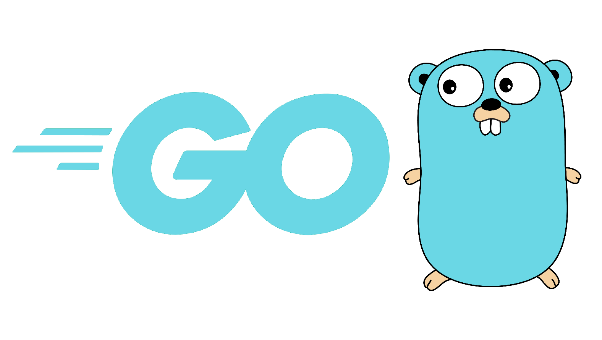

# Golang Learning Repository

This repository contains my learning journey and practice exercises in **Go (Golang)**.

Go is a statically typed, compiled programming language designed by Google. It is known for its simplicity, performance, and strong support for concurrency.

---

## What is Go?

Go (also called Golang) is an open-source programming language created to make software development simple, fast, and reliable.

It is widely used for:

- Backend development
- APIs and microservices
- Cloud applications
- System programming
- DevOps tools

---

## Key Features of Go

- Simple and clean syntax
- Fast compilation and execution
- Built-in concurrency (goroutines)
- Strong standard library
- Cross-platform support
- Memory efficient

---

## What I am learning in this repository

- Go syntax and fundamentals
- Variables, functions, and control structures
- Structs and interfaces
- Working with files and input/output
- HTTP and API handling
- Environment variables
- Project structure in Go

---

##  Why Go?

Go is widely used in modern backend systems because it:

- Handles high performance workloads
- Supports concurrency easily
- Is simple to learn compared to other backend languages
- Is used by companies like Google, Uber, and Dropbox

---

## Learning Goals

- Build strong backend development skills
- Understand API development in Go
- Learn system design basics using Go
- Build production-ready applications

---